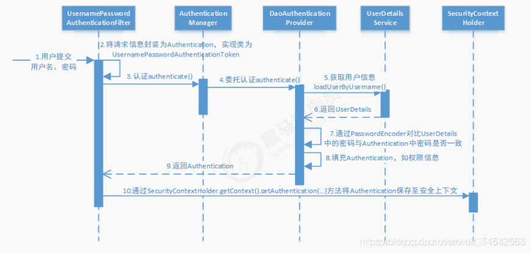

# Getting Started

### Reference Documentation

For further reference, please consider the following sections:

* [Official Apache Maven documentation](https://maven.apache.org/guides/index.html)
* [Spring Boot Maven Plugin Reference Guide](https://docs.spring.io/spring-boot/docs/2.6.3/maven-plugin/reference/html/)
* [Create an OCI image](https://docs.spring.io/spring-boot/docs/2.6.3/maven-plugin/reference/html/#build-image)
* [Spring Web](https://docs.spring.io/spring-boot/docs/2.6.3/reference/htmlsingle/#boot-features-developing-web-applications)
* [Spring Data JPA](https://docs.spring.io/spring-boot/docs/2.6.3/reference/htmlsingle/#boot-features-jpa-and-spring-data)

### Guides

The following guides illustrate how to use some features concretely:

* [Building a RESTful Web Service](https://spring.io/guides/gs/rest-service/)
* [Serving Web Content with Spring MVC](https://spring.io/guides/gs/serving-web-content/)
* [Building REST services with Spring](https://spring.io/guides/tutorials/bookmarks/)
* [Accessing Data with JPA](https://spring.io/guides/gs/accessing-data-jpa/)
* [Accessing data with MySQL](https://spring.io/guides/gs/accessing-data-mysql/)

#flywaydb
1. 引入
   ```xml
       <dependency>
           <groupId>org.flywaydb</groupId>
           <artifactId>flyway-core</artifactId>
       </dependency>
    ```
2. 配置
    ```yaml
    ## 开启，默认开启
    flyway.enabled=true
    ## sql 脚本的位置，默认为 classpath:db/migration。可手动指定
    flyway.locations=classpath:db/migration
    ## 指定数据源，如果没有指定的话，将使用配置的主数据源
    flyway.url=jdbc:mysql://10.0.192.10:3306/数据库名?useUnicode=true&useSSL=false&characterEncoding=utf8
    flyway.user=root
    flyway.password=root
    flyway.check-location=true
    # 如果数据库不是空表，需要设置成 true，否则启动报错
    flyway.baseline-on-migrate=true
    #默认初始版本号为1
    flyway.baseline-version=0
    ```
#mapstruct
1. 引入
   ```xml
      <properties>
         <org.mapstruct.version>1.4.2.Final</org.mapstruct.version>
      </properties>

      <dependencys> 
        <dependency>
            <groupId>org.mapstruct</groupId>
            <artifactId>mapstruct</artifactId>
            <version>${org.mapstruct.version}</version>
        </dependency>
        <dependency>
            <groupId>org.mapstruct</groupId>
            <artifactId>mapstruct-processor</artifactId>
            <version>${org.mapstruct.version}</version>
        </dependency>
      </dependencys>
    ```
2. 使用
   ```java
       @Mapper(componentModel = "spring")
       public interface UserConvert {
           UserDTO toDTO(User user);
           UserVO toVO(UserDTO userDTO);
       }
   ```
3. 坑点（与swagger有冲突，使用exclusions段，移除mapstruct)
   ```xml
       <!--swagger-->
        <dependency>
            <groupId>io.springfox</groupId>
            <artifactId>springfox-swagger2</artifactId>
            <version>2.7.0</version>
            <scope>compile</scope>
            <exclusions>
               <exclusion>
                  <groupId>org.mapstruct</groupId>
                  <artifactId>mapstruct</artifactId>
               </exclusion>
            </exclusions>
       </dependency>
   ```
#swagger
1. 引入  
   swagger2
   ```xml
        <dependency>
            <groupId>io.springfox</groupId>
            <artifactId>springfox-swagger2</artifactId>
            <version>2.7.0</version>
            <scope>compile</scope>
            <exclusions>        swagger2与mapstru有兼容问题
                <exclusion>
                    <groupId>org.mapstruct</groupId>
                    <artifactId>mapstruct</artifactId>
                </exclusion>
            </exclusions>
        </dependency>

        <dependency>
            <groupId>io.springfox</groupId>
            <artifactId>springfox-swagger-ui</artifactId>
            <version>2.7.0</version>
        </dependency>
   ```   
   
   swagger3
   springboot2.2+以上已经集成了swagger3  
   ```xml
        <dependency>
            <groupId>io.springfox</groupId>
            <artifactId>springfox-boot-starter</artifactId>
            <version>3.0.0</version>
        </dependency>      
   ```  
2. 使用  
   Swagger2
   ```java @EnableSwagger2 ```  

   Swagger3
   ```java @EnableOpenApi ```  

3. 访问入口
   Swagger2  
   ```html http://localhost:8080/swagger-ui.html```     

   Swagger3  
   ```html http://localhost:8080/swagger-ui/```  
   
4. 配置方法
   swagger2  
   ```java return new Docket(DocumentType.SWAGGER_2)``  `
   swagger3  
   ```java return new Docket(DocumentType.OAS_30)```  

5. security配置
   Swagger2  
   ```java  
    public void configure(WebSecurity web) throws Exception {
        web.ignoring()
                .antMatchers("/swagger-ui.html")
                .antMatchers("/webjars/**")
                .antMatchers("/v2/**")
                .antMatchers("/swagger-resources/**");
    }
   ```
   
   Swagger3  
   ```java  
    public void configure(WebSecurity web) throws Exception {
        web.ignoring()
                .antMatchers("/swagger**/**")
                .antMatchers("/webjars/**")
                .antMatchers("/v3/**")
                .antMatchers("/doc.html");
    }
   ```
6. swagger配置  
   参考Swagger2Config.java 和 Swagger3Config.java两个文件

#mybatis-plus

#JWT鉴权
1. 安装
   ```xml
        <dependency>
            <groupId>org.springframework.boot</groupId>
            <artifactId>spring-boot-starter-security</artifactId>
        </dependency>
   
        <dependency>
            <groupId>com.auth0</groupId>
            <artifactId>java-jwt</artifactId>
            <version>3.18.2</version>
        </dependency>
   ```
2. 配置  
   a. 自定义类，实现UserDetailsService接口 参见JWTUserDetailService
   b. 自定义类，实现PasswordEncoder接口 参见MD5PasswordEncoder
   c. 定义一个类，存放配置信息， 参考SecurityConfig.java
   
   b. 实现过滤器，参考 JWTAuthorizationFilter.java 根据用户名和密码查询得到用户 
   c. 实现过滤器，参考 JWTAuthenticationFilter.java 根据Header部分的auto字段，校验JWT数据是否合法
   e. 修改swagger配置，参考Swagger2Config.java webAPIConfig-》parmaater
   
3. 流程  
   a. 用户名密码登录 只适用于表单登录  
      （1）先经过UsernamePasswordAuthenticationFilter中的attemptAuthentication(HttpServletRequest request, HttpServletResponse response)  
      （2）然后UserDetailsService中的loadUserByUsername(String username)，获取username对应的用户对象
          如果用户存在, UsernamePasswordAuthenticationFilter中的successfulAuthentication(HttpServletRequest request, HttpServletResponse response, FilterChain chain, Authentication authResult)  
          如果不用户存在, UsernamePasswordAuthenticationFilter中的unsuccessfulAuthentication(HttpServletRequest request, HttpServletResponse response, AuthenticationException failed)  
   b. Token登录 任何页面的鉴权, 除了表单登录  
      （1）先经过BasicAuthenticationFilter的doFilterInternal(HttpServletRequest request, HttpServletResponse response, FilterChain chain);  
      （2）在doFilterInternal中校验token是否过期、获取调用权限  
      （3）校验通过、过滤器放通  
>1. 重要的事情说3遍，如果使用axios前端post发送参数时，如果以data方式发送，必须使用stream方式读取解码，才能获得数据    
    简单起见，请使用params方式发送数据，这样可以直接使用request.getParameter方法获得数据  
>2. 如果不配置直接使用，会走secruity的鉴权流程，会在页面弹一个登录对话框，密码在日志里面（奇葩的一米），如果不配置又不想走鉴权流程    
    使用这个配置，@SpringBootApplication(exclude = {SecurityAutoConfiguration.class})  


#前端数据校验
1. 安装
   ```xml
      <dependency>
         <groupId>org.springframework.boot</groupId>
         <artifactId>spring-boot-starter-validation</artifactId>
         <version>2.5.5</version>
      </dependency>
   ```
2. 配置  
   a. 在需要校验的前端数据处加入注解 (参考UserCreateRequest)  
   b. 在控制层加入注解 (参考UserController) 
      ```java
          public R register(@Validated @ApiParam(value = "用户注册信息", required = true) @RequestBody UserCreateRequest userCreateRequest){
              UserDTO userDTO = userService.register(userCreateRequest);
              return R.ok().data("user", userDTO).message("注册成功");
          }
      ```
   c. 加入全局异常控制 (参考GlobalExceptionHandler)  
      ```java
          @ExceptionHandler({MethodArgumentNotValidException.class})
          @ResponseBody
          public R error(MethodArgumentNotValidException e){
              log.error(ExceptionUtils.getMessage(e));
              return R.error().message(e.getBindingResult().getFieldError().getDefaultMessage()).code(ResultCodeEnum.REGISTER_USER_DATA_NOT_VALID_ERROR.getCode());
          }
      ```